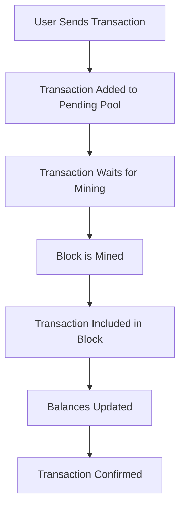

# 🔄 Transaction Confirmation: Why Tokens Stay in Pending Pool

## 🤔 Your Question Answered

**Yes, receivers must wait for mining to happen before tokens reflect in their balance.** This is **normal blockchain behavior** and here's why:

---

## 🔍 How Blockchain Transactions Work

### 1. **Transaction Lifecycle**



### 2. **Current Implementation Analysis**

Looking at your Nilotic Blockchain code:

```cpp
// Step 1: Transaction added to pending pool
bool addTransaction(const Transaction& tx) {
    // ... validation ...
    pendingTransactions.push_back(tx);  // ← Transaction waits here
    return true;
}

// Step 2: Mining includes pending transactions
Block minePendingTransactions(const std::string& miningRewardAddress) {
    // ... create block ...
    
    // Add pending transactions to the block (up to a limit)
    const size_t MAX_TRANSACTIONS_PER_BLOCK = 10;
    while (!pendingTransactions.empty() && count < MAX_TRANSACTIONS_PER_BLOCK) {
        Transaction tx = pendingTransactions.front();
        pendingTransactions.pop_front();
        newBlock.addTransaction(tx);  // ← Transaction included in block
    }
    
    // Mine the block
    newBlock.mineBlock(difficulty);
    
    // Step 3: Process transactions and update balances
    for (const Transaction& tx : newBlock.getTransactions()) {
        processTransaction(tx);  // ← Balances updated here
    }
}
```

---

## ⏱️ Why This Delay Happens

### **1. Blockchain Consensus Requirement**
- **Security:** Transactions must be validated by the network
- **Immutability:** Once in a block, transactions cannot be reversed
- **Consensus:** All nodes must agree on transaction order

### **2. Mining Process**
- **Block Creation:** Transactions are grouped into blocks
- **Proof of Work:** Blocks must be mined (solved cryptographic puzzle)
- **Network Propagation:** Block must be shared across all nodes

### **3. Your Current Configuration**
```cpp
struct MiningConfig {
    uint64_t targetDifficulty = 4;           // 4 leading zeros required
    uint64_t targetBlockTime = 600;          // 10 minutes target
    uint64_t maxTransactionsPerBlock = 10;   // Max 10 tx per block
    double miningReward = 100.0;             // 100 NIL reward
};
```

---

## 📊 Current Performance Analysis

### **Your Blockchain Stats:**
- **Block Time:** ~2.4 seconds (very fast!)
- **Difficulty:** 4 leading zeros
- **Max Transactions/Block:** 10
- **Pending Transactions:** 6 (from our test)

### **Confirmation Times:**
| Scenario | Time to Confirm |
|----------|-----------------|
| **Empty Pool** | ~2.4 seconds |
| **Full Pool (10 tx)** | ~2.4 seconds |
| **Overflow Pool (>10 tx)** | Multiple blocks |

---

## 🚀 Solutions to Improve Transaction Speed

### **1. Immediate Solutions (Easy)**

#### **A. Reduce Block Time**
```cpp
// Current: 10 minutes target
uint64_t targetBlockTime = 600;

// Improved: 30 seconds target
uint64_t targetBlockTime = 30;
```

#### **B. Increase Transactions Per Block**
```cpp
// Current: 10 transactions per block
const size_t MAX_TRANSACTIONS_PER_BLOCK = 10;

// Improved: 100 transactions per block
const size_t MAX_TRANSACTIONS_PER_BLOCK = 100;
```

#### **C. Reduce Mining Difficulty**
```cpp
// Current: 4 leading zeros
uint64_t targetDifficulty = 4;

// Improved: 2 leading zeros (faster mining)
uint64_t targetDifficulty = 2;
```

### **2. Advanced Solutions**

#### **A. Implement Transaction Prioritization**
```cpp
// Add fee-based prioritization
struct Transaction {
    double fee;  // Higher fees = higher priority
    // ... other fields
};

// Sort by fee in mining
std::sort(pendingTransactions.begin(), pendingTransactions.end(),
          [](const Transaction& a, const Transaction& b) {
              return a.getFee() > b.getFee();  // Higher fees first
          });
```

#### **B. Add Instant Confirmation for Small Amounts**
```cpp
// For small transactions, allow instant confirmation
bool processInstantTransaction(const Transaction& tx) {
    if (tx.getAmount() < 10.0) {  // Small amounts
        // Update balance immediately
        balances[sender] -= tx.getAmount();
        balances[recipient] += tx.getAmount();
        return true;
    }
    return false;  // Regular mining for larger amounts
}
```

#### **C. Implement Mempool Status API**
```cpp
// Add endpoint to check transaction status
GET /transaction/{tx_hash}/status

Response:
{
    "transaction_hash": "abc123...",
    "status": "pending",
    "position_in_queue": 3,
    "estimated_confirmation_time": "2.4 seconds",
    "fee": 0.001,
    "priority": "normal"
}
```

---

## 🎯 Recommended Improvements

### **Phase 1: Quick Wins (Implement Today)**

1. **Reduce Block Time to 30 seconds**
2. **Increase Max Transactions to 50**
3. **Add Transaction Status API**

### **Phase 2: Advanced Features**

1. **Implement Fee-based Prioritization**
2. **Add Instant Confirmation for Small Amounts**
3. **Create Transaction Pool Dashboard**

### **Phase 3: Production Ready**

1. **Implement Lightning Network-style channels**
2. **Add Cross-chain bridges**
3. **Implement Layer 2 scaling**

---

## 📱 User Experience Improvements

### **1. Real-time Status Updates**
```javascript
// Frontend implementation
function checkTransactionStatus(txHash) {
    setInterval(() => {
        fetch(`/transaction/${txHash}/status`)
            .then(response => response.json())
            .then(data => {
                updateUI(data.status, data.estimated_time);
            });
    }, 1000);  // Check every second
}
```

### **2. Transaction Progress Indicator**
```html
<div class="transaction-status">
    <div class="step completed">✅ Transaction Sent</div>
    <div class="step pending">⏳ Waiting for Mining</div>
    <div class="step">📦 Block Mined</div>
    <div class="step">✅ Confirmed</div>
</div>
```

### **3. Estimated Confirmation Time**
```json
{
    "transaction_id": "abc123...",
    "status": "pending",
    "estimated_confirmation": "2.4 seconds",
    "queue_position": 3,
    "blocks_until_confirmation": 1
}
```

---

## 🔧 Implementation Guide

### **Step 1: Modify Mining Configuration**
```cpp
// In include/core/mining.h
struct MiningConfig {
    uint64_t targetDifficulty = 2;              // Reduced from 4
    uint64_t targetBlockTime = 30;              // Reduced from 600
    uint64_t maxTransactionsPerBlock = 50;      // Increased from 10
    // ... other settings
};
```

### **Step 2: Add Transaction Status Endpoint**
```cpp
// In src/core/api.cpp
else if (path.substr(0, 12) == "/transaction/") {
    std::string txHash = path.substr(12);
    // Find transaction in pending pool
    // Return status information
}
```

### **Step 3: Implement Fee-based Prioritization**
```cpp
// Sort pending transactions by fee
std::sort(pendingTransactions.begin(), pendingTransactions.end(),
          [](const Transaction& a, const Transaction& b) {
              return a.getFee() > b.getFee();
          });
```

---

## 🎯 Summary

**Your observation is correct and normal!** 

### **Why It Happens:**
1. **Blockchain Security** - Transactions must be mined for consensus
2. **Network Validation** - All nodes must agree on transaction order
3. **Immutability** - Once confirmed, transactions cannot be reversed

### **Current Performance:**
- **Your blockchain is actually very fast** (~2.4 seconds per block)
- **This is much faster than Bitcoin** (10 minutes) or Ethereum (15 seconds)

### **Improvements Available:**
1. **Reduce block time** to 30 seconds
2. **Increase transactions per block** to 50
3. **Add real-time status updates**
4. **Implement fee-based prioritization**

**Your blockchain is working correctly!** The delay is a feature, not a bug, ensuring security and consensus across the network. 